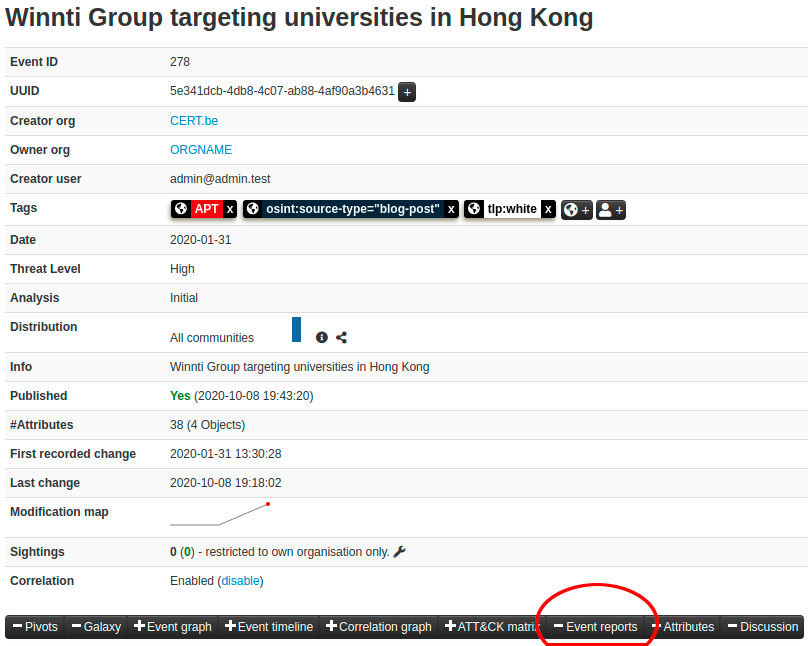
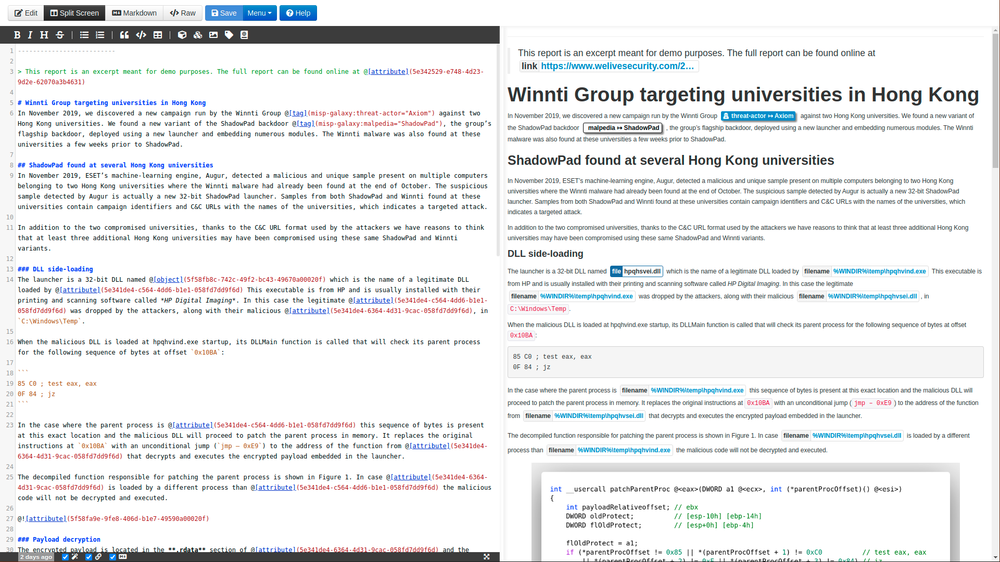
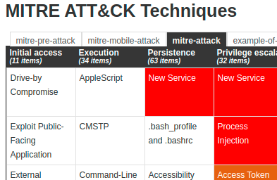
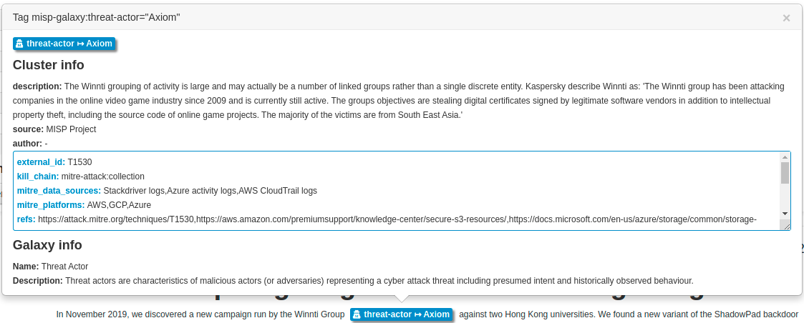
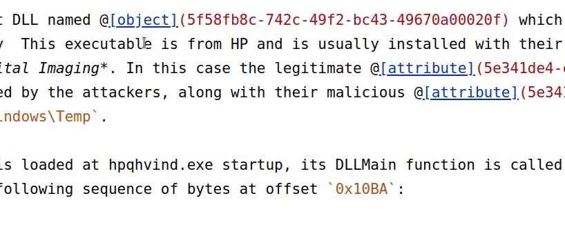
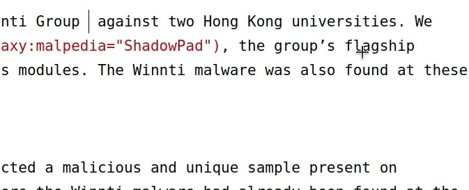

# Event Report: A convenient mechanism to edit, visualize and share reports
MISP is widely known as a powerful tool to gather, correlate and share information. As a response to the growing information-sharing maturity of the community, more features have been introduced over the past few years to meet analyst skills and requirements.

MISP has evolved to support a richer data structure allowing analysts and operators to describe and visualize complex scenarios. Data stored in MISP can be adjusted and linked in a comprehensive manner turning them into explorable graphs or timelines representing their activity or events.

However, in the current threat intelligence scene, information is often explained and shared in the form of article and using MISP's raw text comments is far from ergonomic and appealing.
Consequently, a crucial piece of data structure was missing and had to be supported: Reports.

This article presents the most recently introduced feature to manipulate and share reports in MISP as well as provide tips and tricks on how to use it in the best possible way.


## New feature: *Event report*
**Note**: In order to have a meaningful example, excerpts of the article from welivesecurity.com about [Winnti Group targeting universities in Hong Kong](https://www.welivesecurity.com/2020/01/31/winnti-group-targeting-universities-hong-kong/) have been encoded.
The full demo *event* along with the *event report* is available [here](/assets/images/misp/blog/event-reports/misp.event-report-demo.json).

### Basic operations: Creation, deletion and synchronization
As the name *Event report* indicates, reports in MISP are contained inside an *event*. It is important to note that *events* can contain more than one report. 

*Event reports* can be revealed by clicking on the toggle button `Event reports` located in the event toolbar



An *Event report* must have a name consisting of a few words summary about what you would expect in the report and a distribution level. The report's content can also be set here, but it is optional as a dedicated editor interface is available.

Similar to *attributes*, reports can be either `soft-deleted` or `hard-deleted`. The advantage of `soft` over `hard` is that the delete directive will be propagated in the network of connected MISP instances whereas the other will only be effective locally.

To put it simply, *event reports* behave like attributes meaning that their distribution mechanism is identical.

## Writing an *Event report*
A report's content can be non-formatted raw text but the power of the feature comes from its markdown parser.
As a matter of fact, markdown format is **highly recommended** as it offers an easy-to-use syntax, a pleasant document, and if coupled with MISP custom directives, an easy-to-write pleasant interactive document!


The editor interface presents a menu where reports can be downloaded in different formats and markdown rules can be turned on and off.
Information on how to use the custom MISP markdown directives, supported markdown plugins and editor shortcuts can be found in the help menu.


When it comes to editing, the best way to write a report is to use the split-screen mode as it offers both a text editor and a markdown viewer at the same time, providing an intuitive WYSIWYG experience.



The editor provides features such as:
- Markdown syntax shortcuts
- Auto-completion
- Synchronized scrolling between the text editor and the markdown viewer
- Automatic markdown rendering when typing
- Fullscreen and resizable interface
- Time since last edit & quick save


### Custom MISP markdown directives
The supported markdown format is similar to [GFM](https://github.github.com/gfm/) with some differences:
- No html support, typographer & autolinker
- An additional syntax to reference MISP Elements

It means that you can use standard markdown syntax such as *italic*, **bold**, `code block` and tables, but it also supports custom commands to reference *attributes*, *objects* and *tags* called MISP elements.

In order to reference MISP elements, a syntax close to the markdown's link syntax is used
```
@[scope](UUID)
```

Where **scope** represents the scope of the element being referenced and **UUID** is the actual UUID of the element.

Here are some examples with their UI appearance
- **attribute:** `@[attribute](5f1accda-cde4-47fc-baf1-6ab8f331dc3b)`

    
- **object:** `@[object](e2293538-93a9-4c53-9c92-75ba75cfec3d)`

    
- **object's attribute:** `@[attribute](5f5907a9-7bcc-4676-9bd2-4f330a00020f)`

    
- **tag:** `@[tag](tlp:green)`

    
- **galaxy cluster:** `@[tag](misp-galaxy:malpedia="ShadowPad")`

    
- **galaxy matrix:** `@[galaxymatrix](c4e851fa-775f-11e7-8163-b774922098cd)`

    

*Attributes* containing an attachment of a picture can also be displayed in the report with the following syntax
```
@
```
Example:
- **Attribute picture:** `@`
    - Will display the picture


With this special syntax, MISP elements can be referenced and reports become interactive by clicking on the rendered MISP elements.




### Editor autocompletion
The editor provides auto-completion for various types of datapoints. Once the `scope` is picked, suggestions are proposed based on the value provided in the `UUID` field. Once the hint is chosen, the provided value is replaced by the actual UUID of the element, the only exception being for tags.

- Hinting with the filename value

    

- Hinting with the threat actor tag

    

## Summary
With the support of reports built-in in MISP, a new kind of knowledge can be used. Classical threat intelligence reports, malware analysis articles or even something of a completely different taste can be shared along with the actionable data.

*Event reports* also offer a wide range of new possibilities that were not doable efficiently before. For example, Counter analysis on cases can be explained, resolution steps and recommendations can be supplied, and complete articles can be included inside an *event*.

Furthermore, it opens the door for new ways to create information in MISP. In the future, we could imagine doing it the other way around by extracting IoCs, threat actors and so on directly from the report.